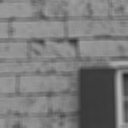
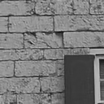
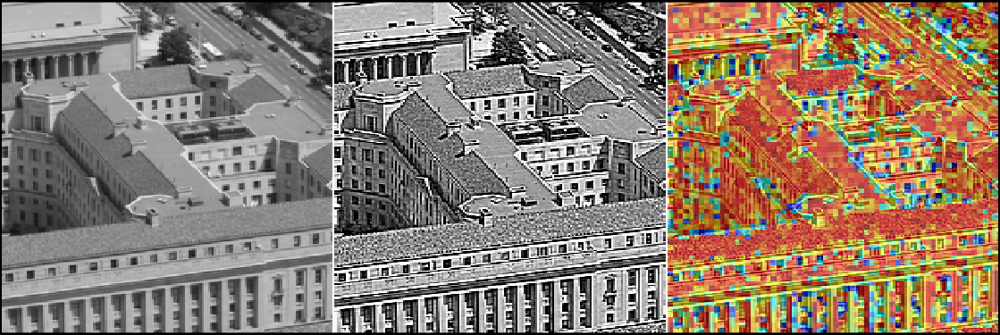

# Supplementary Material for IEEE MMSP 2026
Supplementary Material for IEEE MMSP 2026
**A Subjective Study on a New Sharpness Informed Class of Metrics** 
Authors:<samp>{aurangau, vibhootv, dramsook, anil.kokaram}@tcd.ie</samp>

## Abstract
Perceptual loss functions in Deep Neural Network
(DNN) deblurring architectures improve the overall quality of
restored images. However, few focus on explicitly targeting
sharpness in the restorations. We conduct a subjective study of
models trained with and without losses which explicitly target
sharpness using a four-protocol approach, exploring preferred
sharpness levels and effects on image quality. We introduce a
novel dataset of images with uniform sharpness increments along
with Difference Mean Opinion Scores (DMOS). Additionally,
we propose a novel class of Sharpness Informed (SI) Image
Quality Assessment (IQA) metrics which properly penalize over-
sharpening. Our new SI-PSNR metric outperforms all other
PSNR variants in terms of correlation statistics on IQA bench-
marking datasets. We show that, on average, images restored
using a sharpness-aware composite loss are preferred in 67% of
binarized comparisons, as opposed to losses that do not explicitly
target sharpness.

## Ablation Study on the selection of Hyper-parameters
The equation (5) in our paper is as follows:

$$
L_c = L(I, \tilde{I}) - \beta \cdot Q(\tilde{I})
$$

To produce restoration during training, we may set the hyper-parameter value $\beta$ to either reduce the sharpness of the restorations or increase them. The following experiment was also performed as part of our work [1]  where we examine the effect of $\beta$. This can be seen in Table 1.
| $\beta$ | PSNR (dB) | SSIM | $Q$ | LPIPS
| --- | --- | --- | --- | --- |
| **0** | **35.069** | **0.944** | **0.153** | **0.127**
| 0.001 | 35.102 | 0.945 | 0.152 | 0.117
| 0.01 | 35.101 | 0.945 | 0.154 | 0.117 
| 0.05 | 34.844 | 0.945 | 0.166 | 0.122
| 0.1 | 33.641 | 0.940 | 0.183 | 0.127

A visual example of this phenomenon can be seen below.
| |  |  | 
| --- | --- | --- |
| Blurry Image | $\beta$ = 0 | $\beta$ = 0.001 |

|  |  |  |
| --- | --- | --- |
| $\beta$ = 0.01 | $\beta$ = 0.05 | $\beta$ = 0.1 |

## Sharpness Informed Metrics

## Ablation Study on the Exponentiation of Ringing Detection Ratio
The Ringing Detection Ratio (RDR) or $\alpha$ between a distorted image ($\tilde{I}$) and reference image ($I$) may be defined as follows.

$$
\alpha = \frac{|\tilde{Q} - Q|}{Q}
$$

This ratio measures the increase or decrease in sharpness of the distorted image with respect to the reference image. A higher $\alpha$ intuitively corresponds to more ringing or blur, whereas a lower value corresponds to little ringing or blur. This ratio can be used to construct a ringing map as given in the figure below. In this, the patch size for measuring $\alpha$ has been set to 4. The image size is 512 $\times$ 512. 

To measure the Sharpness Informed (SI) - PSNR, we first measure patch-wise SI-MSE (Equation (2) in the paper) which is as follows.

$$
\text{SI-MSE}(\tilde{I}, I) = \text{MSE}(\tilde{I}, I) \cdot \alpha^\rho
$$

We noticed that exponentiating $\alpha$ to $\rho$ results in better Pearson correlation between the metric (SI-PSNR) and Difference Mean Opinion Scores (DMOS). We perform the exponentiation experiment over two datasets - our proposed dataset and KADID-10K [2].
Tables 2 and 3 show the ablation study of exponentiating $\alpha$ to $\rho$ on our proposed dataset for SI-PSNR
| *ρ*   | 0.05   | 0.10   | 0.15   | 0.20   | 0.30   | 0.40   | 0.50   | 0.60   | 0.70   | 0.80   | 0.90   | 1.00   |
| ----- | ------ | ------ | ------ | ------ | ------ | ------ | ------ | ------ | ------ | ------ | ------ | ------ |
| PLCC  | 0.7296 | 0.7385 | 0.7471 | 0.7555 | 0.7709 | 0.7847 | 0.7971 | 0.8083 | 0.8185 | 0.8278 | 0.8361 | 0.8432 |
| KRCC  | 0.5689 | 0.5741 | 0.5829 | 0.5891 | 0.6066 | 0.6198 | 0.6321 | 0.6453 | 0.6567 | 0.6611 | 0.6690 | 0.6760 |
| SROCC | 0.7538 | 0.7616 | 0.7689 | 0.7753 | 0.7909 | 0.8021 | 0.8123 | 0.8211 | 0.8347 | 0.8420 | 0.8514 | 0.8587 |
| RMSE  | 5.7434 | 5.6627 | 5.5820 | 5.5024 | 5.3494 | 5.2061 | 5.0715 | 4.9444 | 4.8242 | 4.7112 | 4.6072 | 4.5146 |

*Table 2*

| *ρ*   | 1.05   | 1.10   | 1.15   | 1.20   | 1.30   | 1.40*   | 1.50   | 1.60   | 1.70   | 1.80   | 1.90   | 2.00   |
| ----- | ------ | ------ | ------ | ------ | ------ | --------- | ------ | ------ | ------ | ------ | ------ | ------ |
| PLCC  | 0.8463 | 0.8490 | 0.8514 | 0.8534 | 0.8562 | 0.8574* | 0.8571 | 0.8552 | 0.8521 | 0.8478 | 0.8424 | 0.8362 |
| KRCC  | 0.6812 | 0.6777 | 0.6804 | 0.6821 | 0.6777 | 0.6812* | 0.6751 | 0.6690 | 0.6637 | 0.6602 | 0.6496 | 0.6391 |
| SROCC | 0.8612 | 0.8600 | 0.8638 | 0.8657 | 0.8655 | 0.8694* | 0.8686 | 0.8666 | 0.8644 | 0.8604 | 0.8528 | 0.8466 |
| RMSE  | 4.4736 | 4.4368 | 4.4045 | 4.3772 | 4.3383 | 4.3215* | 4.3265 | 4.3518 | 4.3951 | 4.4538 | 4.5250 | 4.6057 |

*Table 3*
  
Tables 4 and 5 show the ablation study of exponentiating $\alpha$ to $\rho$ on the KADID-10K datasett for SI-PSNR
| *ρ*   | 0.05    | 0.10    | 0.15    | 0.20    | 0.30   | 0.40   | 0.50   | 0.60   | 0.70   | 0.80   | 0.90   | 1.00   |
| ----- | ------- | ------- | ------- | ------- | ------ | ------ | ------ | ------ | ------ | ------ | ------ | ------ |
| PLCC  | 0.8785  | 0.8808  | 0.8829  | 0.8849  | 0.8886 | 0.8919 | 0.8949 | 0.8976 | 0.9001 | 0.9023 | 0.9042 | 0.9055 |
| KRCC  | 0.6988  | 0.7021  | 0.7050  | 0.7069  | 0.7116 | 0.7150 | 0.7175 | 0.7197 | 0.7220 | 0.7231 | 0.7241 | 0.7242 |
| SROCC | 0.8801  | 0.8823  | 0.8843  | 0.8859  | 0.8892 | 0.8922 | 0.8947 | 0.8967 | 0.8990 | 0.9001 | 0.9014 | 0.9021 |
| RMSE  | 10.3282 | 10.2393 | 10.1540 | 10.0722 | 9.9188 | 9.7780 | 9.6489 | 9.5305 | 9.4218 | 9.3219 | 9.2328 | 9.1748 |

*Table 4* 

| *ρ*   | 1.05*   | 1.10   | 1.15   | 1.20   | 1.30   | 1.40   | 1.50   | 1.60   | 1.70   | 1.80   | 1.90   | 2.00   |
| ----- | --------- | ------| ------ | ------ | ------ | ------ | ------ | ------ | ------ | ------ | ------ | ------ |
| PLCC  | 0.9056* | 0.9051 | 0.9041 | 0.9029 | 0.9002 | 0.8969 | 0.8935 | 0.8913 | 0.8901 | 0.8891 | 0.8881 | 0.8867 |
| KRCC  | 0.7242* | 0.7225 | 0.7197 | 0.7159 | 0.7099 | 0.7049 | 0.7015 | 0.6981 | 0.6952 | 0.6925 | 0.6892 | 0.6859 |
| SROCC | 0.9015* | 0.8994 | 0.8965 | 0.8929 | 0.8869 | 0.8817 | 0.8778 | 0.8752 | 0.8689 | 0.8674 | 0.8654 | 0.8629 |
| RMSE  | 9.1725* | 9.1948 | 9.2391 | 9.2962 | 9.4171 | 9.5621 | 9.7108 | 9.8038 | 9.8550 | 9.8953 | 9.9403 | 9.9956 |

*Table 5*
The numbers highlighted with * are the ones reported in Table 1 of our paper. 

The similar experiment can be done for SI-SSIM, where we use $\alpha$ to weight SSIM[3]. Tables 6 and 7 demonstrate the effects of exponentiating $\alpha$ to $\rho$ for SSIM on our proposed dataset. 
| *ρ*   | 0.05   | 0.10   | 0.15   | 0.20   | 0.30   | 0.40   | 0.50   | 0.60   | 0.70   | 0.80   | 0.90   | 1.00   |
| ----- | ------ | ------ | ------ | ------ | ------ | ------ | ------ | ------ | ------ | ------ | ------ | ------ |
| PLCC  | 0.9107 | 0.9100 | 0.9091 | 0.9081 | 0.9058 | 0.9032 | 0.9006 | 0.8980 | 0.8954 | 0.8929 | 0.8904 | 0.8880 |
| KRCC  | 0.7585 | 0.7611 | 0.7568 | 0.7524 | 0.7497 | 0.7418 | 0.7374 | 0.7339 | 0.7313 | 0.7269 | 0.7269 | 0.7225 |
| SROCC | 0.9238 | 0.9241 | 0.9223 | 0.9209 | 0.9199 | 0.9156 | 0.9135 | 0.9106 | 0.9096 | 0.9056 | 0.9049 | 0.9020 |
| RMSE  | 3.4691 | 3.4816 | 3.4977 | 3.5162 | 3.5582 | 3.6032 | 3.6490 | 3.6943 | 3.7384 | 3.7810 | 3.8221 | 3.8616 |

*Table 6*

| *ρ*   | 1.05   | 1.10   | 1.15   | 1.20   | 1.30   | 1.40   | 1.50   | 1.60   | 1.70   | 1.80   | 1.90   | 2.00   |
| ----- | ------ | ------ | ------ | ------ | ------ | ------ | ------ | ------ | ------ | ------ | ------ | ------ |
| PLCC  | 0.8868 | 0.8856 | 0.8845 | 0.8833 | 0.8811 | 0.8789 | 0.8768 | 0.8747 | 0.8727 | 0.8707 | 0.8688 | 0.8669 |
| KRCC  | 0.7225 | 0.7190 | 0.7172 | 0.7164 | 0.7146 | 0.7120 | 0.7076 | 0.7058 | 0.7023 | 0.7014 | 0.7006 | 0.6962 |
| SROCC | 0.9020 | 0.9002 | 0.8989 | 0.8983 | 0.8972 | 0.8958 | 0.8922 | 0.8902 | 0.8886 | 0.8875 | 0.8857 | 0.8836 |
| RMSE  | 3.8808 | 3.8996 | 3.9180 | 3.9361 | 3.9712 | 4.0050 | 4.0377 | 4.0692 | 4.0997 | 4.1293 | 4.1580 | 4.1861 |

*Table 7*

Tables 8 and 9 demonstrate the same phenomenon on the KADID-10K dataset.
| *ρ*   | 0.05   | 0.10   | 0.20   | 0.30   | 0.40   | 0.50   | 0.60   | 0.70   | 0.80   | 0.90   | 1.00   |
| ----- | ------ | ------ | ------ | ------ | --------- | ------ | ------ | ------ | ------ | ------ | ------ |
| PLCC  | 0.8837 | 0.8844 | 0.8855 | 0.8862 | 0.8864 | 0.8863 | 0.8858 | 0.8851 | 0.8842 | 0.8831 | 0.8819 |
| KRCC  | 0.6671 | 0.6670 | 0.6700 | 0.6717 | 0.6720 | 0.6727 | 0.6725 | 0.6710 | 0.6697 | 0.6677 | 0.6661 |
| SROCC | 0.8695 | 0.8692 | 0.8707 | 0.8712 | 0.8711 | 0.8709 | 0.8703 | 0.8687 | 0.8674 | 0.8657 | 0.8640 |
| RMSE  | 0.4049 | 0.4037 | 0.4018 | 0.4007 | 0.4003 | 0.4006 | 0.4013 | 0.4025 | 0.4040 | 0.4057 | 0.4077 |

*Table 8*

| *ρ*   | 1.05   | 1.10   | 1.20   | 1.30   | 1.40   | 1.50   | 1.60   | 1.70   | 1.80   | 1.90   | 2.00   |
| ----- | ------ | ------ | ------ | ------ | ------ | ------ | ------ | ------ | ------ | ------ | ------ |
| PLCC  | 0.8813 | 0.8806 | 0.8791 | 0.8776 | 0.8760 | 0.8743 | 0.8726 | 0.8708 | 0.8690 | 0.8671 | 0.8652 |
| KRCC  | 0.6651 | 0.6639 | 0.6620 | 0.6603 | 0.6583 | 0.6562 | 0.6536 | 0.6511 | 0.6491 | 0.6461 | 0.6434 |
| SROCC | 0.8629 | 0.8621 | 0.8601 | 0.8582 | 0.8560 | 0.8538 | 0.8514 | 0.8487 | 0.8467 | 0.8440 | 0.8412 |
| RMSE  | 0.4087 | 0.4098 | 0.4121 | 0.4146 | 0.4171 | 0.4197 | 0.4224 | 0.4252 | 0.4280 | 0.4308 | 0.4337 |

*Table 9*
## Protocol Specifications
The current paragraph is a list of protocols that were used to perform the experiments. We use a 4 protocol approach.
### Protocol 1 - Method of Adjustment
To gauge the preferred level of sharpness for providing estimates of optimal sharpness across different image contents, subjects viewed a single image equipped with a slider and were tasked with adjusting the slider to their preferred level of sharpness. The slider was initialized at 0, which corresponded to a test image with no distortions or gains in sharpness.

### Protocol 2 - Two-Alternative Forced Choice (2AFC)
To assess whether incorporating a composite loss produced sharper restorations, subjects were presented with pairs of images restored using different methods and loss functions. For each pair, they were forced to select the image they perceived as sharper.

### Protocol 3 - Double Stimulus Impairment Scale (DSIS)
To examine the correlation between standard Full-Reference (FR) and No-Reference (NR) metrics with DMOS, subjects were shown a Ground Truth (GT) image alongside a sharpened version, generated at varying intensity increments of 0.25 units using unsharp masking (imsharpen() in MATLAB). They were then asked to rate the quality of the sharpened image relative to the GT on a scale of 0 to 100, where a value of 50 meant both images were perceptually identical. A value below 50 corresponded to the sharpened image being worse than GT, and a value above 50 meant that the sharpened image was better than GT. This range was chosen over the standard 5-point scale to better capture perceptual differences. 

We acknowledge the deviation from standard protocol specifications as DSIS assumes that the test image will always be ranked at a lower score than the reference image, which is applicable for degradations such as blur, noise and JPEG artifacts. However, for sharpness enhancement, a slight sharpness increase over the reference image is usually perceptually better. This observation led us to modify the protocol to better suit our problem.

### Protocol 4 - Pairwise Comparison Evaluation
To assess the overall quality of restorations rather than sharpness, subjects simultaneously viewed two restored images and rated both individually on a scale of 0 to 100, where higher scores indicated better quality.

## Correlation between Metrics and DMOS

## Dataset on MOS, DMOS and Metric Values

## References
[1] U. Aurangabadkar, D. Ramsook and A. Kokaram, "A Sharpness Based Loss Function for Removing Out-of-Focus Blur," 2024 IEEE 26th International Workshop on Multimedia Signal Processing (MMSP), West Lafayette, IN, USA, 2024, pp. 1-6, doi: 10.1109/MMSP61759.2024.10743912. GitHub Repo - https://github.com/aurangau/MMSP2024

[2] Lin, Hanhe, Vlad Hosu, and Dietmar Saupe. "KADID-10k: A large-scale artificially distorted IQA database." 2019 Eleventh International Conference on Quality of Multimedia Experience (QoMEX). IEEE, 2019.

[3] Zhou Wang, A. C. Bovik, H. R. Sheikh and E. P. Simoncelli, "Image quality assessment: from error visibility to structural similarity," in IEEE Transactions on Image Processing, vol. 13, no. 4, pp. 600-612, April 2004, doi: 10.1109/TIP.2003.819861.
